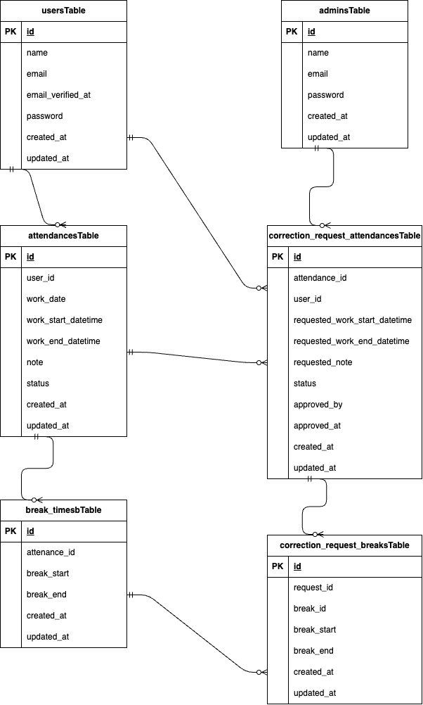

# Attendance -Management -App(勤怠管理アプリ)

## アプリ概要
本アプリは、勤怠の打刻・管理・修正申請・承認を行う勤怠管理システムです。
一般ユーザーと管理者で権限を分け、実務に近い運用を想定しています。

## 環境構築
**Dockerビルド**
1. `git clone git@github.com:maaaakka/Attendance-Management-App.git`
2. `cd Attendance-Management-App`(プロジェクトフォルダに移動)
3. DockerDesktopアプリを立ち上げる
4. `docker-compose up -d --build`

> *MacのM1・M2チップのPCの場合、`no matching manifest for linux/arm64/v8 in the manifest list entries`のメッセージが表示されビルドができないことがあります。
エラーが発生する場合は、docker-compose.ymlファイルの「mysql」内に「platform」の項目を追加で記載してください*
``` bash
mysql:
    platform: linux/amd64  # ← M1/M2の場合のみ追加
    image: mysql:8.0.26
    environment:
```

**Laravel環境構築**
1. `docker-compose exec php bash`
2. `composer install`
3. `cp .env.example .env`
4. .envに以下の環境変数を追加
``` text
APP_URL=http://localhost

DB_CONNECTION=mysql
DB_HOST=mysql
DB_PORT=3306
DB_DATABASE=laravel_db
DB_USERNAME=laravel_user
DB_PASSWORD=laravel_pass
```
5. Fortify初期設定
``` bash
php artisan vendor:publish --provider="Laravel\Fortify\FortifyServiceProvider"
```
※ 本プロジェクトでは laravel/fortify は composer.json に含まれているため追加でcomposer requireを実行する必要はありません。

6. アプリケーションキーの作成
``` bash
php artisan key:generate
```

7. mailhog設定
docker-compose.ymlに追記
``` text
mailhog:
        image: mailhog/mailhog
        ports:
            - "1025:1025"
            - "8025:8025"
```

.envに以下の環境変数を追加
``` text
MAIL_MAILER=smtp
MAIL_HOST=mailhog
MAIL_PORT=1025
MAIL_USERNAME=null
MAIL_PASSWORD=null
MAIL_ENCRYPTION=null
MAIL_FROM_ADDRESS="admin@example.com"
MAIL_FROM_NAME="${APP_NAME}"
```

```bash
docker-compose up -d
```
ブラウザでアクセスしてメールを確認できます
URL http://localhost:8025

8. マイグレーションの実行
``` bash
php artisan migrate
```

9. シーディングの実行(ダミーデータ)
``` bash
php artisan db:seed
```
一般ユーザー６人分
- 名前	 ユーザー1〜ユーザー6
        (それぞれ数字部分のみ変更でログイン可)
- アドレス   user1@test.com〜user6@test.com
            (それぞれ数字部分のみ変更でログイン可)
- パスワード(全ユーザー)	password

管理者ユーザー１人分
- 名前		管理者
- アドレス	 admin@test.com
- パスワード password


10. テスト用DB設定
① テスト用データベース作成
```bash
docker-compose exec mysql bash
mysql -u root -p
# パスワードは root を入力
CREATE DATABASE attendance_test;
```

② .env.testing 作成
```
APP_ENV=testing
APP_KEY=
※ 以下のコマンドで自動生成
php artisan key:generate
php artisan key:generate --env=testing

APP_DEBUG=true

LOG_CHANNEL=stack

DB_CONNECTION=mysql
DB_HOST=mysql
DB_PORT=3306
DB_DATABASE=attendance_test
DB_USERNAME=root
DB_PASSWORD=root

MAIL_MAILER=array

CACHE_DRIVER=array
SESSION_DRIVER=array
QUEUE_CONNECTION=sync
```

## テスト
以下のコマンドでテストを実行
```bash
php artisan test
```

## 主なテスト内容
- 認証機能
- 勤怠打刻機能
- 勤怠一覧取得
- 勤怠更新処理
- 管理者機能
- 修正申請機能

**注意点**
- テスト実行前に attendance_test データベースを作成してください
- .env と .env.testing の設定ミスに注意してください
- テスト実行時は .env.testingを使用し、本番データには影響しません
- 本プロジェクトでは RefreshDatabase を使用しているため、テスト実行時に自動でマイグレーションが実行されます。そのため、通常は php artisan migrate --env=testing の実行は不要です。
- ※ テスト実行時にエラーが出る場合はattendance_test データベースが既に存在している可能性があります。その場合は削除後、再作成してください。(エラー時の対処例：rm -rf /var/lib/mysql/attendance_test)


## 主な機能
一般ユーザー
- 会員登録/ログイン/メール認証
- 出勤、休憩、退勤打刻
- 勤怠一覧、勤怠詳細確認
- 勤怠修正申請
管理者
- 全ユーザー勤怠一覧確認
- 勤怠詳細、編集
- 修正申請の承認
- スタッフ別勤怠管理


## 追加実装
①修正申請中の編集制御
↪管理者側で承認待ちの修正申請がある場合は編集不可とした
**理由**
- データの整合性を保つため
- 承認フローと直接編集が競合しないようにするため

②ページネーション実装
**理由**
- ユーザー数などの増加時のパフォーマンス改善

③バリデーション強化
・出退勤の前後関係チェック
・休憩時間の整合性チェック
・片側入力の禁止
**理由**
- 不正な勤怠データの登録を防ぐため

## 使用技術(実行環境)
- PHP8.3.0
- Laravel8.83.27
- MySQL8.0.26

## ER図
アプリのデータベース構成


## ログイン情報
一般ユーザー
- メール: user1@test.com(他５人分はそれぞれ数字部分のみ変更でログイン可)
- パスワード: password
管理者
- URL: http://localhost/admin/login
- メール: admin@test.com
- パスワード: password

## URL
- 開発環境(ユーザー画面)：http://localhost/
- 管理者ログイン :http://localhost/admin/login
- Mailhog :http://localhost:8025
- phpMyAdmin:：http://localhost:8080/
